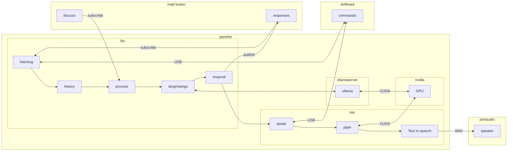

```mermaid
flowchart LR
subgraph panelist
    subgraph llm
        listening-->history
        history-->process
        process-->langchaingo
        langchaingo-->respond
    end
    subgraph say
        respond-->speak
        speak-->piper
        piper-->tts[Text to speech]
    end
    subgraph ollamaserver
        langchaingo<-->ollama
    end
    subgraph nvidia
        ollama<-- CUDA -->GPU
        piper<-- CUDA -->GPU
    end
end
subgraph dollhead
    speak<-- USB -->commands
    listening<-- USB -->commands
end
subgraph mqtt broker
    discuss-- subscribe -->process
    respond-- publish -->responses
    responses-- subscribe -->listening
end
subgraph portaudio
    tts-- WAV -->speaker
end
```
